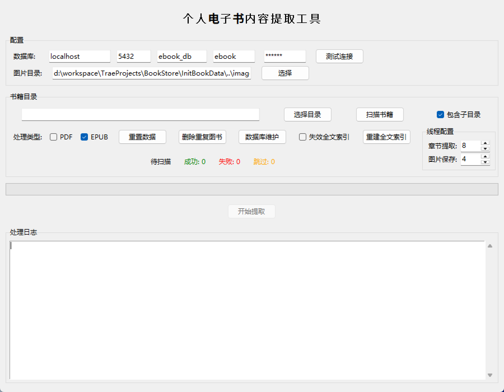
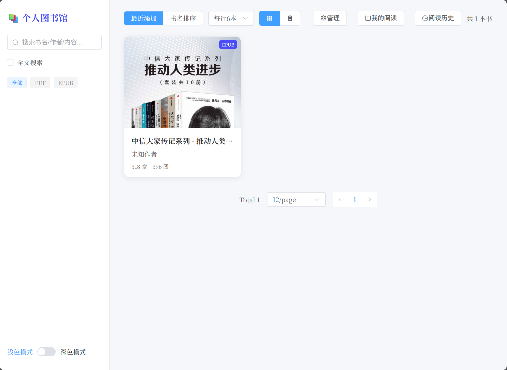
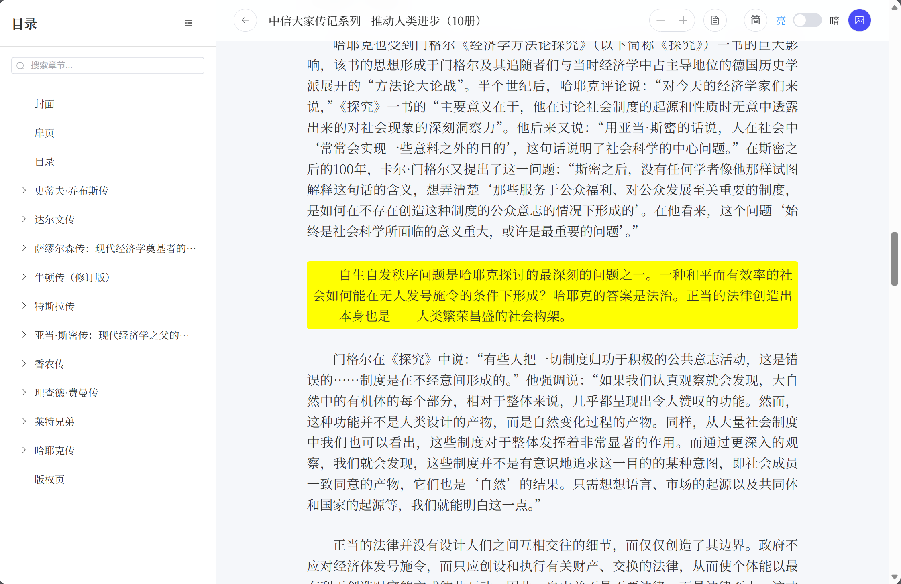

# 📚 EBook Reader & Manager

一个功能完整的电子书阅读与管理系统，支持 PDF 和 EPUB 格式，提供内容提取、阅读、收藏、阅读历史、全文搜索等功能。

本项目为作者的**第1个Vibe Coding项目**，使用 [Trae CN](https://www.trae.ai/) 工具开发，模型使用 **MINIMAX 2.5**，需求源于作者的个人需求，希望能够将电脑里几百本的 EPUB 和 PDF 电子书内容提取出来，保存到本地数据库中，方便后续阅读和管理。

## ✨ 功能特性

### 📖 书籍管理
- 支持 PDF 和 EPUB 格式电子书
- 自动提取书籍封面、目录、章节内容
- 书籍信息展示（标题、作者、出版社、ISBN等）
- 书籍评分和阅读进度追踪

### 📑 内容提取
- **PDF 提取**：提取文本、图片、表格
- **EPUB 提取**：提取章节层级结构、图片、样式，支持目录间补充内容
- 自动保存提取的图片到本地
- 支持复杂排版的内容解析
- 批量导入，支持多线程处理

### 🔍 全文搜索
- 支持根据**书名、作者、内容**进行搜索
- 搜索结果以列表展示，包括图书封面、书名、作者、搜索到的内容片段
- 点击搜索结果可跳转至阅读界面并定位到搜索到的内容位置
- 支持 pg_trgm 索引加速（可选）

### 📱 阅读功能
- 优雅的阅读界面
- 章节导航和目录跳转
- 阅读历史记录
- 阅读时长统计
- 简繁体切换
- 目录全部展开/收缩

### ⭐ 收藏与列表
- 收藏喜欢的书籍
- 正在阅读列表
- 阅读历史记录

### 🛠️ 管理工具
- 批量导入书籍（支持失效/重建全文索引）
- 重新提取书籍内容
- 删除重复书籍
- 重置数据库

## 🖼️ 截图预览

### 数据导入工具



### Web 管理界面

**首页**



**图书详情页**


**全文搜索**


**阅读页**



## 🏗️ 技术架构

### 前端
- **Vue 3** - 渐进式 JavaScript 框架
- **Element Plus** - UI 组件库
- **Vue Router** - 路由管理
- **Axios** - HTTP 客户端
- **OpenCC** - 简繁体转换

### 后端
- **FastAPI** - 现代 Python Web 框架
- **SQLAlchemy** - ORM 数据库工具
- **PostgreSQL** - 关系型数据库
- **Uvicorn** - ASGI 服务器

### 数据处理
- **PyMuPDF** - PDF 处理
- **EbookLib** - EPUB 处理
- **BeautifulSoup** - HTML/XML 解析
- **Pillow** - 图片处理

## 📁 项目结构

```
BookStore/
├── frontend/              # 前端项目
│   ├── src/
│   │   ├── pages/        # 页面组件
│   │   ├── utils/        # 工具函数
│   │   ├── App.vue       # 根组件
│   │   └── main.js       # 入口文件
│   ├── index.html
│   ├── package.json
│   └── vite.config.js
├── backend/               # 后端项目
│   ├── api/              # API 路由
│   ├── db/               # 数据库配置和模型
│   ├── main.py           # 入口文件
│   └── requirements.txt
├── InitBookData/          # 数据初始化工具
│   ├── epub_extractor.py # EPUB 提取器
│   ├── pdf_extractor.py  # PDF 提取器
│   ├── image_processor.py # 图片处理器
│   ├── main.py           # GUI 工具
│   ├── db.py             # 数据库操作
│   └── sql/              # SQL 脚本
├── images/                # 提取的图片存储目录
├── Screenshot/           # 截图
├── start.bat              # Windows 一键启动脚本
└── README.md
```

## 🚀 快速开始

### 环境要求
- Python 3.8+
- Node.js 16+
- PostgreSQL 12+

### 1. 克隆项目

```bash
git clone https://github.com/yourusername/BookStore.git
cd BookStore
```

### 2. 数据库配置

创建 PostgreSQL 数据库并执行初始化脚本：

```sql
CREATE DATABASE ebook_db;
```

然后执行数据库初始化脚本：
```bash
psql -U postgres -d ebook_db -f InitBookData/sql/init_database.sql
```

**可选**：如需全文搜索功能，创建 trigram 索引：
```sql
CREATE EXTENSION pg_trgm;
CREATE INDEX idx_paragraphs_content_trgm ON paragraphs USING gin (content gin_trgm_ops);
```

### 3. 后端配置

```bash
cd backend

# 创建 Python 虚拟环境（推荐）
python -m venv venv

# 激活虚拟环境
# Windows:
venv\Scripts\activate
# macOS / Linux:
source venv/bin/activate

# 安装依赖
pip install -r requirements.txt

# 配置环境变量
cp .env.example .env
# 编辑 .env 文件，填入数据库信息
```

### 4. 前端配置

```bash
cd frontend
npm install
```

### 5. 启动服务

**方式一：使用一键启动脚本（Windows）**
```bash
start.bat
```

**方式二：手动启动**

启动后端：
```bash
cd backend
uvicorn main:app --reload --host 0.0.0.0 --port 8000
```

启动前端：
```bash
cd frontend
npm run dev
```

访问 http://localhost:3000 即可使用。

## ⚙️ 配置说明

### 后端环境变量 (.env)

```env
DB_HOST=localhost
DB_PORT=5432
DB_NAME=ebook_db
DB_USER=your_username
DB_PASSWORD=your_password
IMAGES_DIR=../images
```

### 前端配置

前端配置文件位于 `frontend/vite.config.js`，默认代理到后端 `http://localhost:8000`。

## 📖 使用说明

### 导入书籍

1. 运行 `InitBookData/main.py` 打开数据初始化工具
2. 配置数据库连接并测试连接
3. 选择书籍文件目录，点击"扫描书籍"
4. 勾选"失效全文索引"（导入大量数据时建议勾选，可提升导入速度）
5. 点击"开始提取"

### 全文索引

- **失效全文索引**：勾选后，导入开始前会删除索引，导入完成后点击"重建全文索引"按钮重建
- **重建全文索引**：导入完成后点击此按钮重建搜索索引

### 阅读书籍

1. 在书籍列表中选择一本书
2. 点击"阅读"按钮
3. 使用目录导航章节
4. 支持简繁体切换
5. 使用全部展开/收缩按钮管理目录

### 管理收藏

- 点击书籍详情页的"收藏"按钮
- 在"我的收藏"页面查看所有收藏书籍

## 🤝 贡献指南

欢迎提交 Issue 和 Pull Request！

1. Fork 本项目
2. 创建你的特性分支 (`git checkout -b feature/AmazingFeature`)
3. 提交你的修改 (`git commit -m 'Add some AmazingFeature'`)
4. 推送到分支 (`git push origin feature/AmazingFeature`)
5. 打开一个 Pull Request

## 📄 许可证

本项目采用 MIT 许可证 - 详见 [LICENSE](LICENSE) 文件
